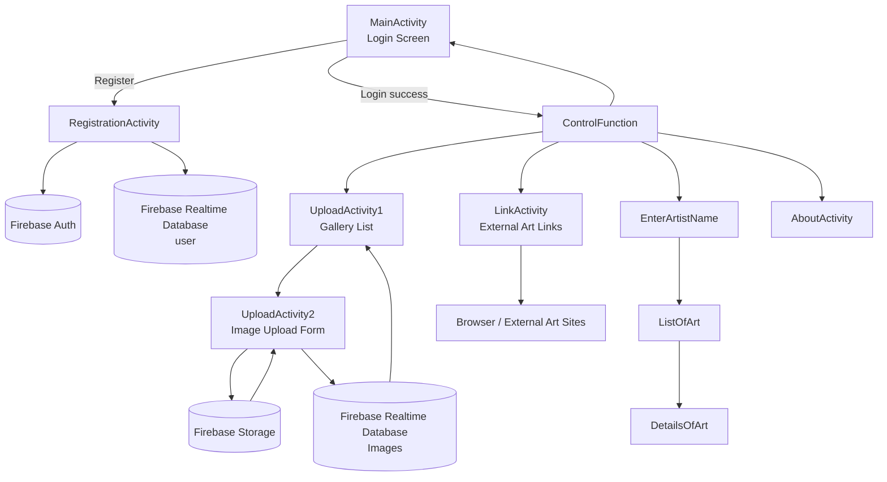
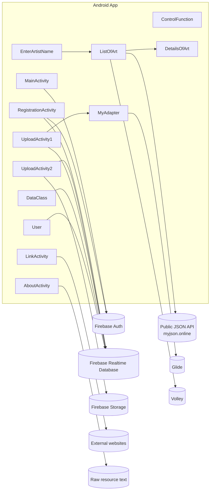

# MyArtGallery App Diagram

This document summarizes the app structure and the main runtime flows in the project.

## App Overview

MyArtGallery is an Android app that uses Firebase Authentication, Firebase Realtime Database, Firebase Storage, Volley, and Glide.

## Screen Flow

## Data And Service Diagram

## Main Data Models

- `User`: stores registration data such as name, email, date of birth, gender, and password.
- `DataClass`: stores uploaded art image URLs and captions.

## Notes

- `MainActivity` is the launcher screen.
- `ControlFunction` is the main menu after login.
- `UploadActivity2` uploads images to Firebase Storage, then saves the download URL and caption to Realtime Database.
- `ListOfArt` fetches artist data from a remote JSON API and opens `DetailsOfArt` for the selected item.
